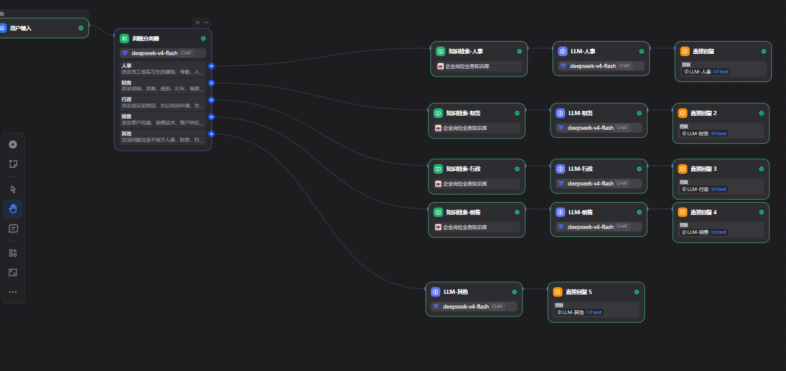
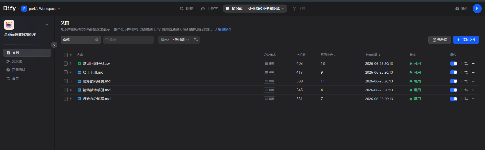
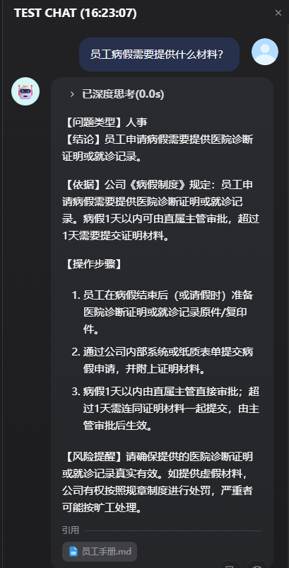

# 企业多岗位 AI 工作助手

## 1. 项目简介

本项目基于 Dify 本地化部署构建企业内部 AI 工作助手，面向人事、财务、行政、销售等企业办公场景，实现员工制度问答、财务报销指引、行政流程查询和销售话术生成。

项目通过 Dify Chatflow 编排多岗位业务 Agent，接入 DeepSeek-v4-flash 作为对话生成模型，使用 Ollama + bge-m3 作为本地 Embedding 模型，结合企业岗位业务知识库完成 RAG 检索增强问答。

本项目模拟企业内部常见岗位场景，重点展示 AI Agent 搭建、Prompt Engineering、知识库构建、业务流程分类、RAG 检索增强和多场景测试评估能力。

---

## 2. 项目背景

在企业实际办公场景中，行政、人事、财务、销售等岗位经常需要处理大量重复性问题，例如：

* 员工请假、离职、入职流程咨询
* 报销材料、发票要求、审批规则查询
* 会议室预定、合同盖章、办公用品申请
* 客户异议处理、销售话术生成

传统处理方式依赖人工答复，存在响应慢、标准不统一、重复劳动多等问题。因此，本项目尝试构建一个企业内部 AI 工作助手，通过知识库和 Agent 工作流帮助员工快速获取业务答案。

---

## 3. 技术栈

| 模块           | 技术                      |
| ------------ | ----------------------- |
| AI 应用平台      | Dify                    |
| 本地部署         | Docker Compose / WSL2   |
| 对话模型         | DeepSeek-v4-flash       |
| Embedding 模型 | Ollama + bge-m3         |
| 知识库方案        | RAG 检索增强生成              |
| 工作流编排        | Dify Chatflow           |
| 场景分类         | 问题分类器                   |
| 分支处理         | 条件分支 / 多岗位流程            |
| Prompt 设计    | 结构化 Prompt / 场景化 Prompt |
| 测试评估         | 多场景测试集                  |

---

## 4. 系统架构

整体流程如下：

```text
用户输入
   ↓
问题分类器
   ↓
业务场景判断：人事 / 财务 / 行政 / 销售 / 其他
   ↓
对应岗位知识库检索
   ↓
对应岗位 LLM Prompt 生成回答
   ↓
直接回复用户
```

当前 Chatflow 结构：

```text
用户输入
   ↓
问题分类器
   ├── 人事 → 知识检索-人事 → LLM-人事 → 直接回复
   ├── 财务 → 知识检索-财务 → LLM-财务 → 直接回复
   ├── 行政 → 知识检索-行政 → LLM-行政 → 直接回复
   ├── 销售 → 知识检索-销售 → LLM-销售 → 直接回复
   └── 其他 → LLM-其他 → 直接回复
```

---

## 5. 功能模块

### 5.1 人事制度问答

支持员工和实习生相关问题查询，例如：

* 请假申请
* 病假材料
* 入职流程
* 转正流程
* 离职申请
* 实习生管理

示例问题：

```text
实习生离职需要提前多久申请？
```

预期能力：

```text
识别为人事问题，并根据员工手册回答实习生需要提前 7 天提交离职申请。
```

---

### 5.2 财务报销助手

支持财务报销相关问题查询，例如：

* 差旅报销
* 打车报销
* 餐费报销
* 住宿报销
* 发票要求
* 财务审批流程

示例问题：

```text
出差打车 260 元可以报销吗？
```

预期能力：

```text
识别为财务问题，并根据财务报销制度回答单次打车金额超过 200 元时需要补充说明原因，并由直属主管审批。
```

---

### 5.3 行政办公助手

支持行政办公流程查询，例如：

* 会议室预定
* 办公用品申请
* 合同盖章
* 快递寄送
* 访客接待
* 固定资产领用

示例问题：

```text
合同盖章需要准备什么材料？
```

预期能力：

```text
识别为行政问题，并根据行政办公流程回答需要合同终版、审批记录和用印申请。
```

---

### 5.4 销售话术助手

支持销售沟通和客户异议处理，例如：

* 客户觉得成本高
* 客户担心数据安全
* 客户不了解 AI Agent
* 制造业客户沟通
* AI 办公系统介绍

示例问题：

```text
客户觉得 AI 办公系统太贵，销售应该怎么回复？
```

预期能力：

```text
识别为销售问题，并从小范围试点、效率提升、减少重复劳动和长期 ROI 角度生成销售话术。
```

---

### 5.5 其他问题兜底

当用户问题不属于人事、财务、行政、销售四类场景时，进入其他分支。

其他分支不会编造公司制度，而是提示用户当前知识库未覆盖，并建议联系对应部门确认。

---

## 6. 知识库设计

本项目使用模拟企业制度文档构建知识库，包括：

```text
员工手册.md
财务报销制度.md
行政办公流程.md
销售话术手册.md
常见问题FAQ.csv
```

知识库内容覆盖：

| 文档      | 主要内容                        |
| ------- | --------------------------- |
| 员工手册    | 请假、病假、入职、转正、离职、考勤           |
| 财务报销制度  | 差旅、打车、餐费、住宿、发票、报销流程         |
| 行政办公流程  | 会议室、办公用品、合同盖章、快递、访客、资产      |
| 销售话术手册  | 成本顾虑、数据安全、AI Agent 解释、制造业沟通 |
| 常见问题FAQ | 常见业务问题和标准答案                 |

Embedding 模型使用本地 Ollama 的 bge-m3 模型，用于将企业文档向量化，支持后续语义检索。

---

## 7. Prompt 设计

不同岗位分支采用不同 Prompt 模板。

### 人事 Prompt

人事分支要求模型重点关注请假、考勤、入职、转正、离职、实习生管理等内容，并按以下结构回答：

```text
【问题类型】人事
【结论】
【依据】
【操作步骤】
【风险提醒】
```

### 财务 Prompt

财务分支重点关注报销、发票、审批、金额限制等内容，并按以下结构回答：

```text
【问题类型】财务
【结论】
【依据】
【报销材料】
【操作步骤】
【风险提醒】
```

### 行政 Prompt

行政分支重点关注办公流程和材料要求，并按以下结构回答：

```text
【问题类型】行政
【结论】
【依据】
【操作步骤】
【注意事项】
```

### 销售 Prompt

销售分支重点关注客户异议处理和销售话术生成，并按以下结构回答：

```text
【问题类型】销售
【客户顾虑】
【推荐沟通角度】
【销售话术】
【后续跟进建议】
```

---

## 8. 测试集设计

本项目构建了多场景测试集，用于验证问题分类、知识库命中和回答格式稳定性。

| 编号 | 测试问题                 | 期望分类 | 测试结果 |
| -- | -------------------- | ---- | ---- |
| 1  | 实习生离职需要提前多久申请？       | 人事   | 通过   |
| 2  | 我想请 3 天年假，需要提前多久申请？  | 人事   | 通过   |
| 3  | 员工病假需要提供什么材料？        | 人事   | 通过   |
| 4  | 出差打车 260 元可以报销吗？     | 财务   | 通过   |
| 5  | 餐费报销需要准备什么材料？        | 财务   | 通过   |
| 6  | 出差住宿报销需要什么材料？        | 财务   | 通过   |
| 7  | 合同盖章需要准备什么材料？        | 行政   | 通过   |
| 8  | 会议室怎么预定？             | 行政   | 通过   |
| 9  | 客户觉得 AI 办公系统太贵，怎么回复？ | 销售   | 通过   |
| 10 | 客户担心数据安全，销售应该怎么解释？   | 销售   | 通过   |

测试维度包括：

* 场景分类是否正确
* 是否命中知识库
* 回答是否符合指定格式
* 是否存在编造制度
* 回答是否具备可执行性

---

## 9. 项目效果

当前版本已经实现：

* 能够自动识别人事、财务、行政、销售等业务场景
* 能够基于企业知识库生成结构化回答
* 能够引用员工手册、财务制度、行政流程、销售话术等知识来源
* 能够针对不同岗位输出不同格式的回答
* 能够通过其他分支处理知识库未覆盖问题，降低模型幻觉风险

---

## 10. 项目亮点

1. **本地化部署**

   * 使用 Docker Compose 在本地部署 Dify，具备企业内部私有化部署基础。

2. **本地 Embedding**

   * 使用 Ollama + bge-m3 实现本地向量化，适合企业知识库场景。

3. **多岗位 Agent 编排**

   * 通过问题分类器和多分支工作流，将不同岗位问题分配到不同处理链路。

4. **RAG 检索增强**

   * 使用知识库检索结果辅助模型回答，降低模型凭空编造制度的风险。

5. **结构化 Prompt**

   * 针对人事、财务、行政、销售设计不同 Prompt 模板，提升回答格式稳定性和业务适配性。

6. **测试集验证**

   * 构建多场景测试集，对分类准确性、知识库命中和回答质量进行验证。

---

## 11. 后续优化方向

后续可以继续优化以下方向：

1. **拆分多知识库**

   * 将人事、财务、行政、销售拆成独立知识库，提升检索精准度。

2. **加入 Rerank 模型**

   * 在向量检索后加入重排模型，提高召回内容相关性。

3. **增加工具调用**

   * 接入报销金额判断、审批流查询、会议室查询等工具 API。

4. **增加反馈机制**

   * 收集用户对回答的满意度反馈，用于 Prompt 和知识库迭代。

5. **增加评估指标**

   * 引入分类准确率、知识命中率、格式合规率、幻觉率等量化指标。

6. **扩展真实业务系统**

   * 后续可对接 OA、CRM、ERP、飞书、企业微信等企业系统。

---

## 12. 项目总结

本项目从企业内部办公场景出发，完成了一个基于 Dify 的多岗位 AI 工作助手 Demo。项目覆盖本地化部署、模型接入、知识库构建、RAG 问答、Agent 工作流编排、Prompt 设计和测试评估等完整流程。

该项目能够体现 AI Agent 应用实习岗位所需的核心能力，包括 AI 工具调研、业务场景理解、Prompt 优化、知识库搭建、工作流设计和模型效果评估。
## 项目截图

### Chatflow 总流程图



### 知识库页面



### 测试结果示例


